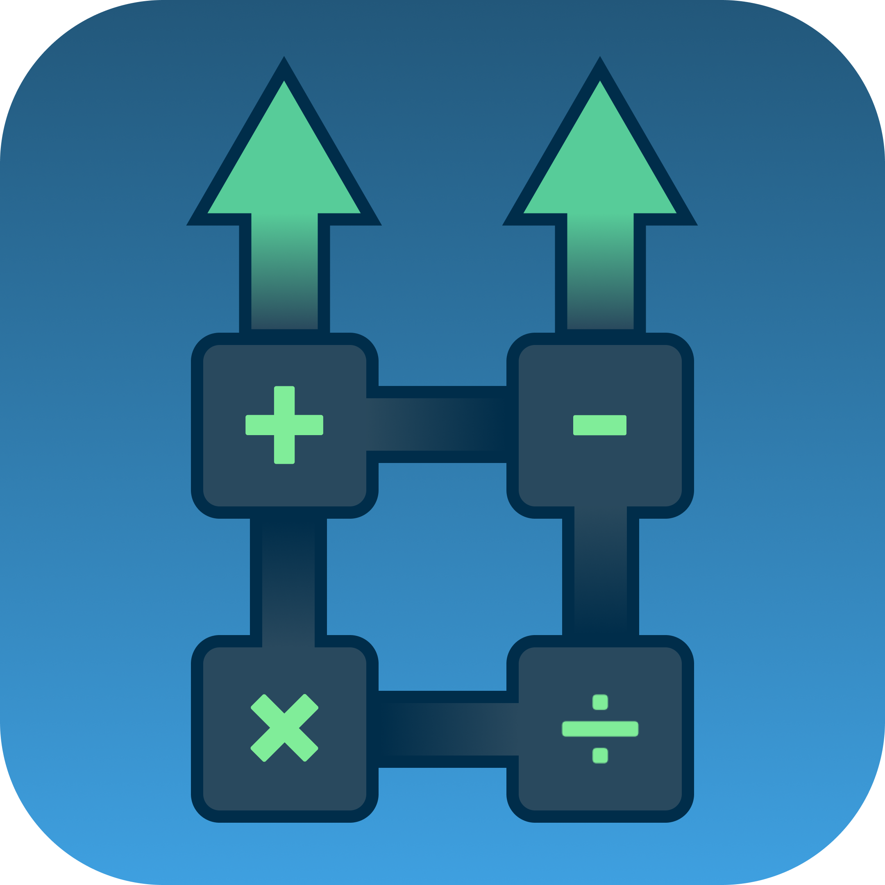

  

<h1 align=center>UpMath 💼</h1>
<md-divider></md-divider>

&nbsp;&nbsp;&nbsp;&nbsp;&nbsp;นักเรียนจำนวนมากยังคงประสบความยากลำบากในการทำความเข้าใจแนวคิดหลักและการจัดรูปสมการในสถานการณ์ต่างๆ ขณะที่ครูผู้สอนต้องเผชิญกับข้อจำกัดด้านเวลาในการสร้างโจทย์ ตรวจคำตอบ และให้คำแนะนำรายบุคคล UpMath จึงถูกพัฒนาขึ้นเพื่อเป็นสะพานเชื่อมระหว่างเทคโนโลยีปัญญาประดิษฐ์ (AI) กับการศึกษาคณิตศาสตร์ โดยมุ่งหวังที่จะยกระดับคุณภาพการเรียนรู้และลดภาระของครูผู้สอน

### วิสัยทัศน์ 👀
&nbsp;&nbsp;&nbsp;&nbsp;&nbsp;UpMath มีเป้าหมายเพื่อเป็นเครื่องมือการศึกษาอัจฉริยะที่ช่วยให้การเรียนการสอนคณิตศาสตร์มีประสิทธิภาพมากขึ้น ผ่านการใช้เทคโนโลยี AI ในการสร้างโจทย์ที่สอดคล้องกับ Bloom's Taxonomy

### นวัตกรรมหลัก 📡
สำหรับครูผู้สอน - UpMathWeb
- ระบบสร้างโจทย์อัจฉริยะ: ใช้ AI สร้างโจทย์คณิตศาสตร์ตามระดับการคิดใน Bloom's Taxonomy
- การจัดการชั้นเรียนแบบดิจิทัล: ระบบครบวงจรสำหรับการมอบหมายงานและติดตามผลการเรียน
- รายงานผลการเรียนรู้: วิเคราะห์ข้อมูลการเรียนรู้ของนักเรียนเพื่อปรับปรุงการสอน

สำหรับนักเรียน - UpMathApp
- คำอธิบายแนวทางแก้ปัญหา: AI ให้คำแนะนำการแก้โจทย์แบบเป็นขั้นตอน
- การตรวจสอบผลลัพธ์ทันที: ระบบตรวจคำตอบและให้คำตอบกลับในทันที

---
### ข้อตกลงในการใช้ซอฟต์แวร์ (Disclaimer)
&nbsp;&nbsp;&nbsp;&nbsp;&nbsp;ซอฟต์แวร์นี้เป็นผลงานที่พัฒนาขึ้นโดย นายเตชินท์ พงษ์มุกดา จาก โรงเรียนยุพราชวิทยาลัย ภายใต้การดูแลของ นายวิรัชชัย จันต๊ะวงศ์ ภายใต้โครงการ เว็บแอปพลิเคชันพัฒนาทักษะและประเมินผลความสามารถทางคณิตศาสตร์ระดับมัธยมศึกษาตอนปลาย ซึ่งสนับสนุนโดย สํานักงานพัฒนาวิทยาศาสตร์และเทคโนโลยีแห่งชาติ โดยมี วัตถุประสงค์เพื่อส่งเสริมให้นักเรียนและนักศึกษาได้เรียนรู้และฝึกทักษะในการพัฒนา ซอฟต์แวร์ ลิขสิทธิ์ของซอฟต์แวร์นี้จึงเป็นของผู้พัฒนา ซึ่งผู้พัฒนาได้อนุญาตให้สํานักงานพัฒนาวิทยาศาสตร์และเทคโนโลยีแห่งชาติ เผยแพร่ซอฟต์แวร์นี้ตาม “ต้นฉบับ” โดยไม่มี การแก้ไขดัดแปลงใดๆ ทั้งสิ้น ให้แก่บุคคลทั่วไปได้ใช้เพื่อประโยชน์ส่วนบุคคลหรือประโยชน์ทางการศึกษาที่ไม่มีวัตถุประสงค์ในเชิงพาณิชย์ โดยไม่คิดค่าตอบแทนการใช้ ซอฟต์แวร์ ดังนั้น สํานักงานพัฒนาวิทยาศาสตร์และเทคโนโลยีแห่งชาติ จึงไม่มีหน้าที่ใน การดูแล บําารุงรักษา จัดการอบรมการใช้งาน หรือพัฒนาประสิทธิภาพซอฟต์แวร์ รวมทั้ง ไม่รับรองความถูกต้องหรือประสิทธิภาพการทํางานของซอฟต์แวร์ตลอดจน ไม่รับประกัน ความเสียหายต่างๆ อันเกิดจากการใช้ซอฟต์แวร์นี้ทั้งสิ้น
